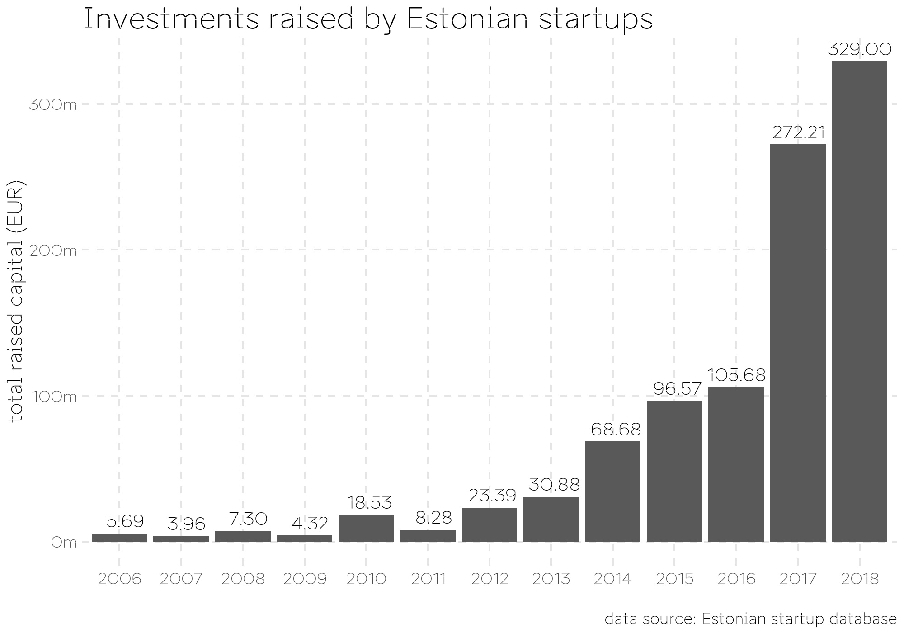
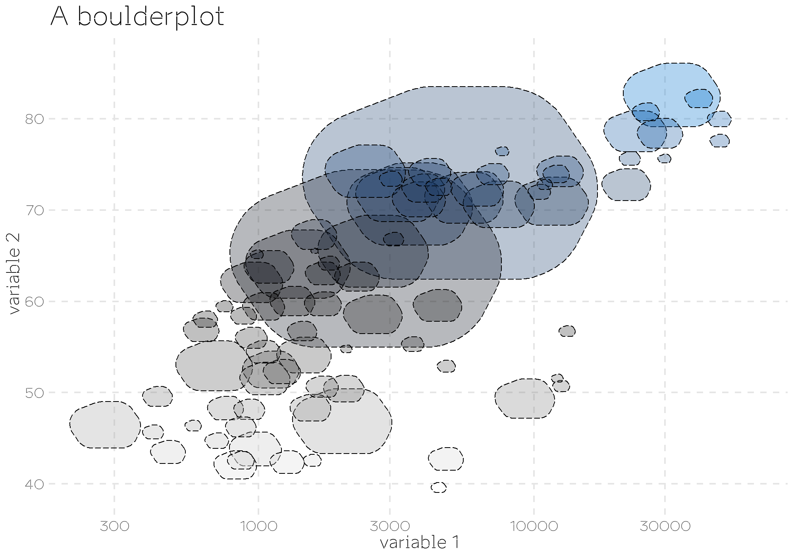
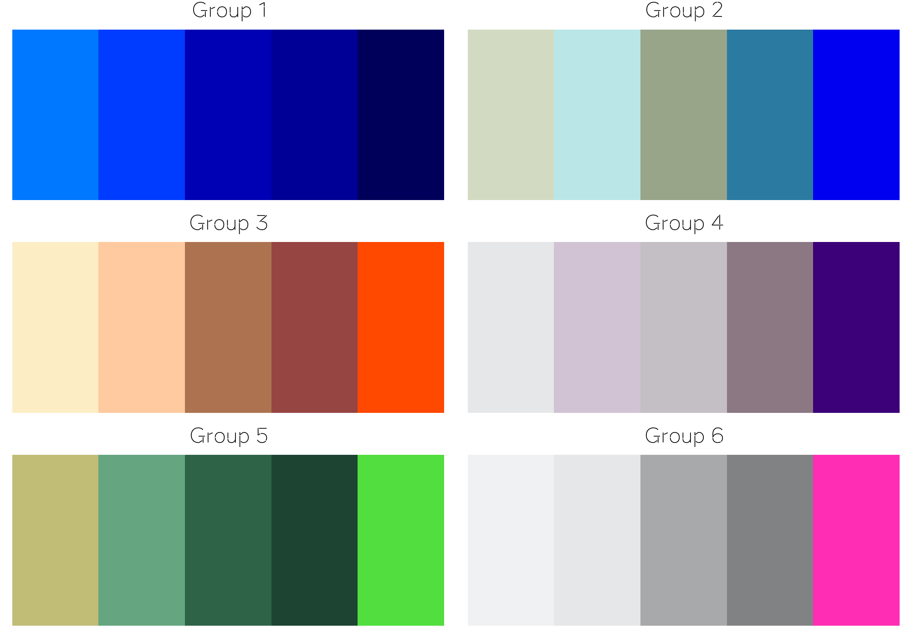

# ggest

This R package contains a set of reusable `ggplot2` functions to work with the [Estonian brand platform](https://brand.estonia.ee/about/). The package provides a theme and colour palettes in the Brand Estonia inspired style, and functions to visualize data with boulderplots.

## Installation

Use the `devtools` package to install the development version from Github:

```
devtools::install_github("tanelp/ggest", dependencies=TRUE)
```

## Examples

### theme_est()

A `ggplot2` theme in the style of Brand Estonia.



### geom_boulder()

A geometric object for creating boulderplots.



### scale_colour_est() and scale_fill_est()

Colour scales in the style of Brand Estonia.



## Using the Aino typeface

The Aino typeface is not included in the package because of its terms and conditions. You can download the typeface from [here](https://toolbox.estonia.ee/media/422). In order to use the font, run the following code:

```R
AINO_FONT_DIR = "/path/to/Aino-fonts"
import_aino_fonts(AINO_FONT_DIR)
```

The package uses `showtext` to display `.otf` fonts. However, the `showtext` package is incompatible with the RStudio's built-in graphics device. As a workaround, you need to open the graphics device manually when working within the RStudio IDE. You can achieve it by calling `x11()`, `quartz()` or `windows()` before creating a plot.

### License

* Check Brand Estonia’s [Terms and Conditions](https://brand.estonia.ee/about/terms/).
* Everything else: MIT.
